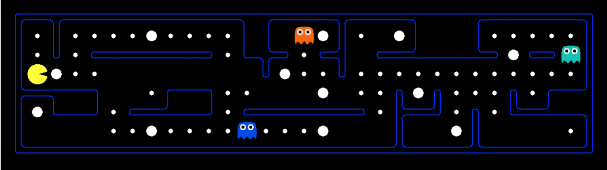
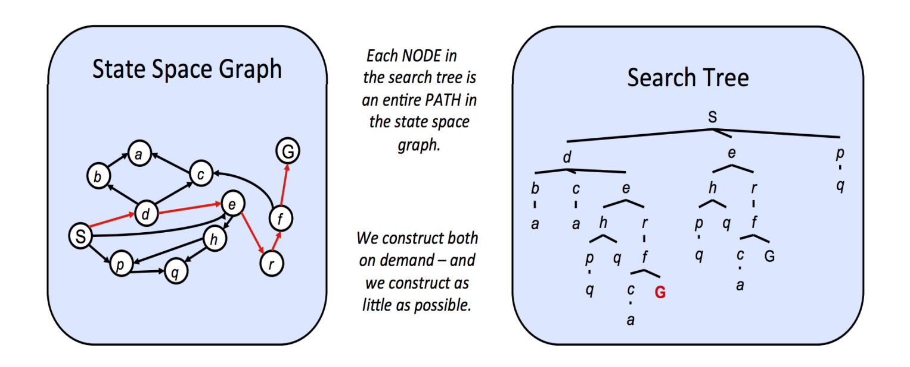
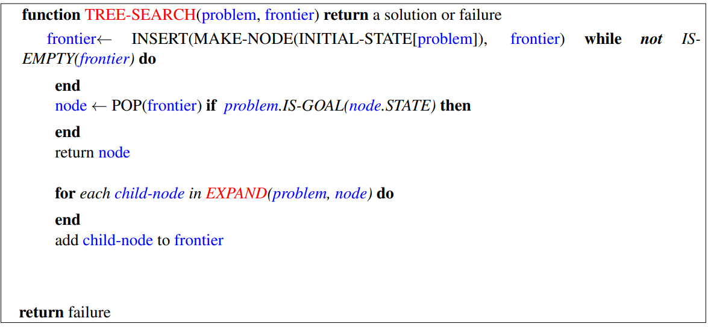
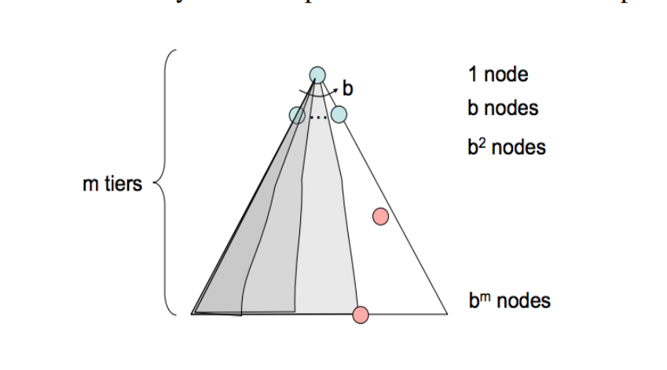
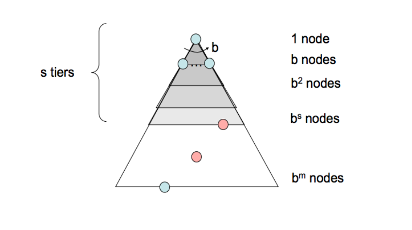

> [!AI_SUMMARY]-
> 无序搜索算法在状态空间中探索解决方案，而不考虑启发式信息。
>
> - **状态空间：**所有可能状态的集合。
> - **搜索树：**从初始状态开始，通过操作生成的状态图。
> - **广度优先搜索（BFS）：**按层级探索状态，确保找到最短路径。
> - **深度优先搜索（DFS）：**沿着一条路径深入探索，可能错过更优解。
> - **统一代价搜索（UCS）：**根据路径成本探索状态，保证找到最低成本路径。

> [!PREREQUISITE]
>
> - [dfs](https://oi-wiki.org/graph/dfs/)
> - [bfs](https://oi-wiki.org/graph/bfs/)

## note

### 状态空间和搜索问题

> 为了创建一个合理的规划代理，我们需要一种方式来<u>数学地表达代理将存在的环境</u>。为此，我们必须正式表达一个搜索问题 - 给定我们的代理当前状态（其在环境中的配置），

搜索问题由以下元素组成：

- **状态空间** - 在您给定世界中可能出现的所有可能状态集合
- **每个状态**中可用的一组操作
- **过渡模型** - 当在当前状态下采取特定动作时输出下一个状态
- **动作成本** - 在应用动作后从一个状态移动到另一个状态时产生
- **初始状态** - 代理最初存在的状态
- **目标测试** - 一个接收状态作为输入的函数，并确定它是否是目标状态

> [!NOTE] 从初始状态到目标状态的一条路径（通常称为计划）
> 
> 起始状态 -> 状态空间（使用动作、转换和成本方法）-> 目标状态

> [!NOTE] 世界状态与搜索状态之间的区别。
> 
> 一个全局状态包含有关给定状态的所有信息，而一个搜索状态仅包含规划所需的世界信息（主要是为了空间效率）。为了说明这些概念，我们将介绍本课程的核心激励示例——吃豆人。

游戏《吃豆人》很简单：吃豆人必须在一个迷宫中导航，并且在不被恶意的巡逻幽灵吃掉的情况下吃掉迷宫中的所有（小）食物豆。如果吃豆人吃掉了一个（大）能量豆，他将在一段时间内对幽灵免疫，并获得吃掉幽灵得分的能力。



### 状态空间大小

一个在估算解决搜索问题的计算运行时间时经常出现的重要问题是状态空间的大小。这几乎完全使用基本的计数原理来完成，该原理指出，如果在一个给定的世界中存在 n 个变量对象，它们可以分别取 x1、x2、...、xn 的不同值，那么状态的总数是 x1 · x2 · ... · xn。

> [!KNOWLEDGE] 基本计数原理
> 
> 基本计数原理是一种确定某种情况下可能的总结果数的方法。如果你有多个选择要做，并且每个选择都有一定数量的选项，你需要将每个选择的选项数相乘。
> 
> 例如，在 Pacman 场景中：
> 
> - Pacman 有 120 个可能的位置。
> - Pacman 可以面对 4 个方向。
> - 有两个幽灵，每个有 12 个可能的位置。
> - 有 30 个食物颗粒，每个可以吃或者不吃（2 个选项）。
> 
> 所以，可能状态的总数是通过将这些数字相乘来计算的： $120 \times 4 \times 12 \times 12 \times 2^{30}$
> 
> 这表示了 Pacman 可以处于的不同状态的总数。

### 状态空间图和搜索树

最终拼图的一部分是状态空间图和搜索树。状态空间图[^1]是通过表示状态的节点构建的，从状态到其子状态存在有向边。

[^1]: 感觉就是有限状态机 (FSM, Finite state machine)。

<u>在状态空间图中，每个状态恰好被表示一次——根本没有必要多次表示一个状态</u>，了解这一点在尝试推理搜索问题时非常有帮助。

尽管搜索树也是一类具有状态作为节点和动作作为状态之间边的图，<u>但每个状态/节点编码的不仅仅是状态本身，还包括从起始状态到给定状态在状态空间图中的整个路径（或计划）</u>。



由于从一种状态到另一种状态通常存在多种方式，状态往往在搜索树中多次出现。因此，搜索树的大小大于或等于其对应的状态空间图。

我们已经确定，状态空间图本身可能非常大，即使是简单问题也是如此，因此问题出现了——如果这些结构太大而无法在内存中表示，我们如何在这些结构上执行有用的计算？答案在于我们如何计算当前状态的孩子——<u>我们只存储我们立即正在处理的状态，并使用相应的 getNextState、getAction 和 getActionCost 方法按需计算新的状态</u>。

### Uninformed Search

<u>标准协议是维护一个由搜索树派生出的部分计划的外部边界，以找到从起始状态到目标状态的计划。</u>我们通过从边界中移除一个节点（使用我们的给定策略选择）来不断扩展我们的边界，并用它的所有子节点替换它。从边界中移除一个元素并用其子节点替换它，相当于丢弃一个长度为 n 的计划，并将所有由此产生的长度为(n+1)的计划考虑在内。我们继续这样做，直到最终从边界中移除一个目标状态，此时我们得出结论，对应于移除的目标状态的部分计划实际上是从起始状态到目标状态的路径。

实际上，大多数此类算法的实现都会在节点对象中编码关于父节点、到节点距离以及节点内部状态的信息。我们刚才概述的这种程序被称为树搜索，其伪代码如下：

```python title=" pseudocode for tree search"
function TREE-SEARCH(problem, frontier) return a solution or failure
    frontier ← INSERT(MAKE-NODE(INITIAL-STATE[problem]), frontier)
    while not IS-EMPTY(frontier) do
        node ← POP(frontier)
        if problem.IS-GOAL(node.STATE) then
            return node
        end
        for each child-node in EXPAND(problem, node) do
            add child-node to frontier
        end
    end
    return failure

function EXPAND(problem, node) yields nodes
    s← node.STATE
    for each action in problem.ACTIONS(s) do
        s′ ← problem.RESULT(s, action)
    end
    yield NODE(STATE=s′, PARENT=node, ACTION=action)
```

> [!ATTENTION]
>
> 原笔记中的 pseudocode 长下面这个样子：
> 
> 
> 
> 实话说看着很不习惯，所以我会将其以类 python 的格式写下来

> 很熟悉？确实，往下看。
    

我们将依次介绍三种这样的策略：深度优先搜索、广度优先搜索和一致代价搜索。在每个策略中，还将介绍该策略的一些基本属性，具体如下：

- 每个搜索策略的 **完整性** - 如果搜索问题存在解决方案，是否在无限的计算资源下，该策略保证找到它？
- 每个搜索策略的 **优化性** - 该策略是否保证找到到达目标状态最低成本路径？
- **分支因子** b - 每次从队列中出队一个前沿节点并用其子节点替换时，前沿节点数量的增加是 O(b)。在搜索树的深度 k 处，存在 $O(b^k)$ 个节点。
- **最大深度** m
- **最浅解的深度** s

> **深度优先搜索 & 广度优先搜索**  比较常见，这里略过。



> [!INFO]
> 
> 在讨论搜索算法时，我们主要围绕几个方面进行。
> 
> - **描述**
> - **前沿表示**
> - **完整性**
> - **最优性**
> - **时间复杂度**
> - **空间复杂度**
> 
> 在此笔记中，我将详细展示它们；但在后续笔记中，我只会给出一个简要结论。

### Uniform Cost Search

- 描述 - 统一代价搜索（UCS），我们的最后一种策略，是一种探索策略，**始终从起始节点选择最低代价的前沿节点进行扩展**。
- 前沿表示 - 为了表示 UCS 的前沿，通常选择基于堆的优先队列，其中给定入队节点 v 的优先级是从起始节点到 v 的路径成本或 v 的后向成本。直观上，以这种方式构建的优先队列在移除当前最小成本路径并用其子节点替换时，只是简单地重新排列自身以维持所需的路径成本排序。
- 完整性 - **一致代价搜索是完整的**。如果存在目标状态，它必须有一些有限长度的最短路径；因此，UCS 最终必须找到这条最短路径长度。
- 最优性 - 如果我们假设所有边成本都是非负的，UCS 也是最优的。通过构造，由于我们按路径成本递增的顺序探索节点，我们保证找到到达目标状态的最短路径。均匀代价搜索中使用的策略与 Dijkstra 算法相同，主要区别在于 UCS 在找到解决方案状态时终止，而不是找到到达所有状态的最短路径。请注意，在我们的图中存在负边成本可能会使路径上的节点长度递减，从而破坏我们的最优性保证。（有关处理此可能性的较慢算法，请参阅 Bellman-Ford 算法）
- 时间复杂度 - 让我们定义最优路径成本为 $C^∗$ ，以及状态空间图中两个节点之间的最小成本为 ε。然后，我们必须大致探索从 1 到 $C^∗/ε$ 的所有节点深度，导致运行时间为 O( $b^{C^∗/ε}$ )。
- 空间复杂度 - 大致来说，前沿将包含所有最便宜解的节点，因此 UCS 的空间复杂度估计为 O( $b^{C^∗/ε}$ )。

> [!TIP]
>
> 这三种搜索策略的主要区别在于他们扩展（使得 path 变长）策略的不同，而体现在编程上就是使用的数据结构不同：
>
> - DFS -> stack
> - BFS -> queue
> - UCS -> (min) heap

## link

- [cs188-sp24-note02](https://inst.eecs.berkeley.edu/~cs188/sp24/assets/notes/cs188-sp24-note02.pdf)
