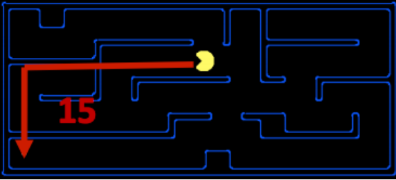
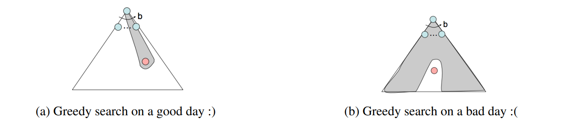
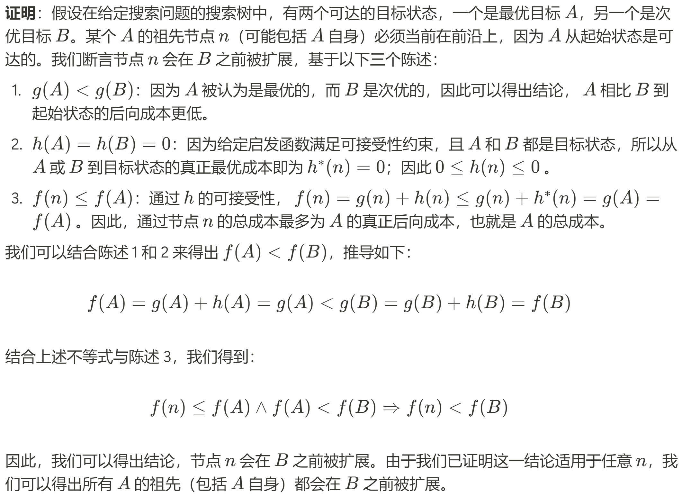
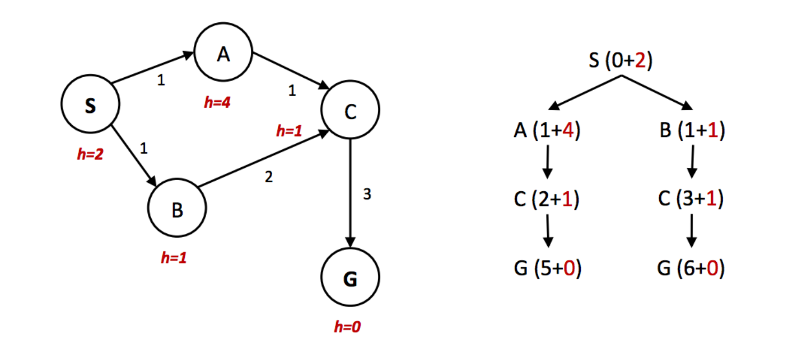
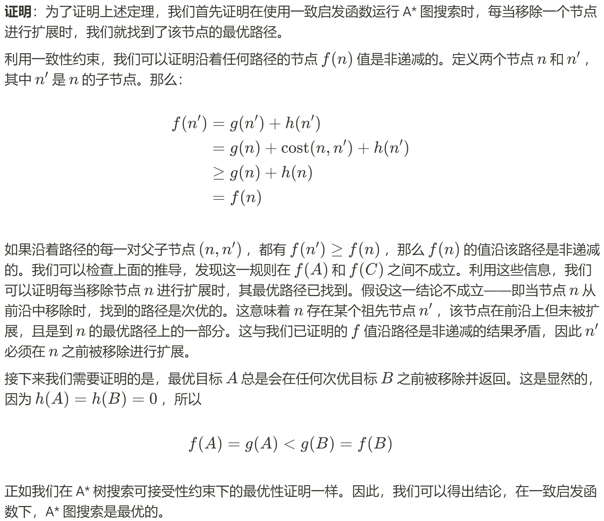

> [!PREREQUISITE]
> 
> - [Norm](https://www.wikiwand.com/zh/articles/%E8%8C%83%E6%95%B0)
> - [序关系](https://darstib.github.io/blog/note/cs70/note/18-Misc/#_5)

# 笔记
### Informed Search

统一代价搜索很好，因为它既完整又最优，但它可能相当慢，因为它在搜索目标时从起始状态向所有方向扩展。如果我们<u>有一些关于我们应该关注搜索方向的观念</u>，我们可以显著提高性能，并更快地“聚焦”于目标。这正是启发式搜索的重点。

### Heuristics（启发式）

启发式方法是允许估计目标状态距离的驱动力 - 它们是<u>接受状态作为输入并输出相应估计</u>的函数。

> 该函数所执行的计算针对要解决的搜索问题特定。以下我们将看到在 A* search中的原因。

我们通常希望启发式函数是<u>目标剩余距离的下界</u>，因此启发式通常是放宽问题（其中已移除原始问题的某些约束）的解。

转向我们的 Pacman 示例，让我们考虑之前描述的路径问题。解决此问题常用的启发式方法是**曼哈顿距离**，对于两个点 $(x_1，y_1)$ 和 $(x_2，y_2)$ ，其定义为：

$$Manhattan(x_1, y_1, x_2, y_2) = |x_1 −x_2|+|y_1 −y_2|$$



> [!HELP]
> 
> 也就是说，我们先将条件放宽（在上图中就是先忽略墙体）来“试探”地解决 relaxed problem，得到待解决问题的大致下限。

这个偏好概念非常强大，并被以下两个实现启发式函数的搜索算法所使用：**greedy search and A**。

### Greedy Search

- **描述** - 贪心搜索是一种探索策略，它总是选择<u>具有最低启发式值的边界节点进行扩展</u>，这对应于它认为最接近目标的状态。
- **前沿表示** - 贪心搜索与 UCS 操作相同，使用优先队列，同时以启发式值的形式使用估计的前向成本。
- **完整性及最优性** - 贪心搜索不能保证找到存在目标状态，也不是最优的，尤其是在选择了一个非常差的启发式函数的情况下。



### A* Search

- 描述 - A* search是一种探索策略，它始终选择<u>具有最低估计总成本的边界节点进行扩展</u>，其中总成本是从起始节点到目标节点的整个成本。
- 前沿表示 - 就像贪心搜索和 UCS 一样，A* search也使用**优先队列**来表示其前沿。然而，A* search使用估计的总成本（=总后向成本+估计的前向成本(启发值)）
- 完整性及最优性 - 在给定适当的启发式算法（我们稍后会讨论）的情况下，A* search既是完整的也是最优的。

### 可接受性和一致性

现在，让我们花些时间讨论一下什么构成了一个好的启发式方法。

> [!QUESTION]
> 
> 为什么？
> 
> 首先，让我们根据以下定义重新表述 UCS、贪婪搜索和 A*算法中用于确定优先队列排序的方法：
> 
> - g(n) - 由 UCS 计算的总向后成本的函数。
> - h(n) - 启发式值函数，或贪婪搜索中使用的估计前向成本。
> - f(n) - 表示估计总成本的函数，用于 A* search。 $f(n) = g(n) + h(n)$ 。
> 
> 确实，找到破坏这两个宝贵特性的启发式方法非常容易。例如，考虑启发式函数 $h(n) = 1−g(n)$ 。这样的启发式方法将 A* 搜索降低到 BFS。

> [!DEFINITION ]
> 
> 使用 A*树搜索时，达到最优性的条件被称为可接受性。可接受性约束表明，可接受启发式估计的值既不是负数也不是高估，即： $∀n, 0 ≤ h(n) ≤ h^∗ (n)$, （$h^∗(n)$ 是从给定节点 n 到达目标状态的真正最优前向成本）。

> [!THEOREM]
> 
> 对于给定的搜索问题，如果启发式函数 h 满足可接受性约束，则在那个搜索问题中使用带有 h 的 A*树搜索将得到一个最优解。
> 
> 

如果多次访问相同的节点，自然的方法是简单地跟踪已经扩展过的状态，并再次不再扩展它们。添加了这种优化的树搜索被称为**graph search**，其伪代码如下：

```python title="pseudocode for graph search"
function GRAPH-SEARCH(problem, frontier) return a solution or failure
    reached ← an empty set
    frontier ← INSERT(MAKE-NODE(INITIAL-STATE[problem]), frontier)
    while not IS-EMPTY(frontier) do
        node ← POP(frontier)
        if problem.IS-GOAL(node.STATE) then
            return node
        end
        if node.STATE is not in reached then
            add node.STATE in reached
            for each child-node in EXPAND(problem, node) do
                frontier ← INSERT(child-node, frontier)
            end
        end
    end
    return failure
```
    

> [!EXAMPLE] Bad example
> 
> 然而，只需考虑以下简单的状态空间图和相应的搜索树，其中标注了权重和启发式值：
> 
> 
> 
> 在上述示例中，很明显最佳路径是遵循 S → A → C → G，总路径成本为 1+1+3=5。到达目标的另一条路径，S → B → C → G，路径成本为 1+2+3=6。然而，由于节点 A 的启发式值远大于节点 B 的启发式值，节点 C 首先在第二条次优路径上作为节点 B 的子节点被扩展。然后它被放入“已到达”集合中，因此 A* graph search在访问它作为 A 的子节点时未能重新扩展它，因此**它从未找到最优解**。因此，<u>为了在 A* graph search中保持最优性，我们需要一个比可接受性更强的属性。</u>

> [!DEFINITION ]
> 
> **consistency**：一致性的核心思想是我们不仅强制执行启发式方法低估从任何给定节点到目标的总距离，而且还强制执行图中每条边的成本/权重。启发式函数测量的边成本仅仅是两个相连节点的启发式值之差。从数学上讲，一致性约束可以表示如下： $∀A,C\quad h(A)−h(C) ≤ cost(A,C)$

> [!THEOREM]
> 
> 对于给定的搜索问题，如果一致性约束由启发式函数 h 满足，则在那个搜索问题中使用带有 h 的 A* graph search将得到一个最优解。
> 
> 

在继续之前，从上面的讨论中提取几个重要的要点：对于**既是可接受/一致的启发式算法**，根据定义，对于任何目标状态 G，必须有 **h(G) = 0**。

此外，<u>一致性不仅比可接受性更强的约束，一致性还意味着可接受性。这仅仅是因为如果没有边成本是高估的（如一致性所保证的），从任何节点到目标的总估计成本也将不会是高估。</u>这仅仅是因为如果没有边成本是高估的（如一致性所保证的），从任何节点到目标的总估计成本也将不会是高估。

> [!HELP]
>
> 简单来说，**admissible** 要求 heuristic function 即 h(n) 低估到达目标的 cost，而 **consitency** 要求 h(n) 低估任意两个 state 之间的 cost 差。在 consitency 中 $h(A)−h(C) ≤ cost(A,C)$，那么对于任意一条 path，将有 $h(A) - h(G)= \sum (h(A)−h(C)) \leq \sum cost(A, C) = h^*(A)$，而 h(G)=0，故 admissible 条件也满足了。
> 
> note3 给出了一个 admissible but inconsitency 的 h(n)，如果没看懂可见原 [note3#p7](https://inst.eecs.berkeley.edu/~cs188/sp24/assets/notes/cs188-sp24-note03.pdf)
> 
> 

### Dominance（优势度）

该标准度量（创建“良好”启发式算法以及如何判断一个启发式算法是否优于另一个）是优势度。如果启发式算法 a 支配启发式算法 b，那么在状态空间图中每个节点上，a 的估计目标距离都大于 b 的估计目标距离。数学上表示为 $∀n : h_{a}(n) ≥ h_{b}(n)$ 。

> [!INFO]
> 
> 此外，平凡启发式定义为 $h(n) = 0$ ，使用它将 A* 搜索简化为 UCS。所有可接受启发式都优于平凡启发式。平凡启发式通常被纳入搜索问题的 semi-lattice (半格)基础，它位于支配层次结构的底部。
> 
>> [!HELP]
> > 
>> 关键是理解这个 semi-lattice，用序关系来理解就很不错，下面的例子也很好地帮助我们理解。
> 
> 以下是包含各种启发式算法 ha、hb 和 hc 的半格示例，从底部的平凡启发式算法到顶部的精确目标距离：
> 
> 

> 显然，在 dominance 的度量标准下，所有满足我们先前要求的 heuristics 都“不大于” exact 即正确的情况，那么“越大”的 heuristics 越接近于 exact，自然是我们越想要的。

### Search: Summary

关于搜索问题，可以使用各种搜索技术来解决，包括但不限于我们在 CS 188 中学习的五种：

- 广度优先搜索 (*Breadth-first Search*)
- 深度优先搜索 (*Depth-first Search*)
- 统一代价搜索 (*Uniform Cost Search*)
- 贪婪搜索 (*Greedy Search*)
- A* Search

## link

- [cs188-sp24-note03](https://inst.eecs.berkeley.edu/~cs188/sp24/assets/notes/cs188-sp24-note03.pdf)