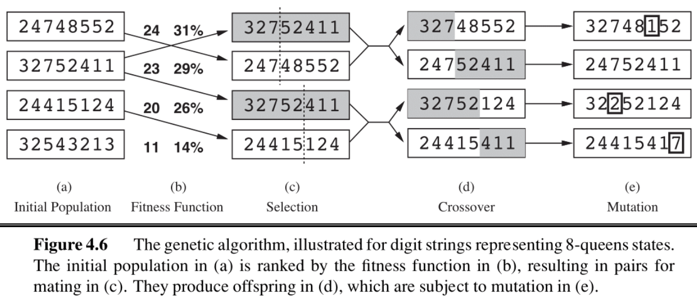

## note

### 本地搜索

> 在前一篇笔记中，我们想要找到目标状态，以及到达那里的最优路径。但在某些问题中，<u>我们只关心找到目标状态</u>——重建路径可能是微不足道的。

本地搜索算法使我们能够找到目标状态，而无需担心到达那里的路径。


上图显示了状态空间中目标函数的一维图。对于该函数，我们希望找到对应最高目标值的状态。<u>局部搜索算法的基本思想是，从每个状态出发，它们在局部移动到具有更高目标值的状态，直到达到最大值（希望是全局最大值）</u>。

我们将介绍四种此类算法：爬山法、模拟退火、局部光束搜索和遗传算法

### 爬山搜索

> [!DEFINITION]
> 
> 爬山搜索算法（或最陡上升）从当前状态移动到使目标值增加最多的相邻状态。

```python title="pseudocode for hill-climbing"
function HILL-CLIMBING(problem) returns a state
    current <- make-node(problem.initial-state)
    loop do
        neighbor <- a highest-valued successor of current
        if neighbor.value ≤ current.value then
            return current.state
        current <- neighbor
```

“爬山法”的“贪婪性”使其容易陷入局部最大值（见图 4.1），因为对于算法来说，这些点在局部看起来像是全局最大值，并且是平原（见图 4.1）。

变体爬山法，如随机爬山法，它随机选择可能的上升动作中的一个动作，已经被提出。

另一种变体，随机横向移动，允许不严格增加目标的移动，使算法能够逃离“肩部”。

爬山法是不完整的。另一方面，随机重启动爬山法，它从随机选择的初始状态进行多次爬山搜索，由于某个随机选择的初始状态最终可以收敛到全局最大值，因此它是显然完整的。

> [!SUMMARY]
> 
> 简单来说，hill-climbing 始终向着目前上升倾向最大的方向；sotchastic hill-climbing 在上升的方向中随机选取一个方向；random sideways moves 则不再拘泥于上升；Random-restart hill-climbing 选择了随机选取多个起点执行 hill-climbing 算法，除去少数极端情况，总能够有一个起点能够到达期望的终点。

### 模拟退火搜索

**模拟退火** 旨在结合随机游走（随机移动到附近状态）和爬山法，以获得完整且高效的搜索算法。在模拟退火中，我们允许移动到可以<u>降低目标的状态</u>。

算法在每一步时间戳选择一个随机移动。<u>如果这个移动导致更高的目标值，它总是被接受。如果它导致更低的目标值，那么这个移动会以一定的概率被接受。</u>这个概率由温度参数决定，初始时较高（允许更多的“坏”移动），并按照某种“时间表”逐渐降低。

理论上，<u>如果温度足够缓慢地降低，模拟退火算法将以概率接近 1 达到全局最大值。</u>

```python title="pseudocode for simulated annealing"
function SIMULATED-ANNEALING(problem, schedule) returns a state
    current ← problem.initial-state
    for t = 1 to ∞ do
        T ← schedule(t)
        if T = 0 then return current
        next ← a randomly selected successor of current
        ΔE ← next.value - current.value
        if ΔE > 0 then
            current ← next
        else
            current ← next only with probability e^(ΔE/T)
```

### 本地束搜索

局部束搜索是爬山搜索算法的另一种变体。这两种算法的关键区别在于<u>局部束搜索在每个迭代中跟踪 k 个状态（线程）</u>。

> [!TIP]
> 
> 本地束搜索相比于爬山法就是“不要在一棵树上吊死”的思路，其同样可以有随机束搜索等变体。

### 遗传算法

遗传算法<u>从 k 个随机初始化的状态开始</u>，这些状态称为种群。状态（称为个体）被表示为有限字母表上的字符串。

> note04 讲的比较啰嗦，但是我觉得先大致看懂伪代码，再结合下面的例子即可。 note04 讲的有点啰嗦，但我认为先大致理解伪代码，然后结合下面的例子就可以了。

```python title="pseudocode for genetic algorithm"
function GENETIC-ALGORITHM(population, FITNESS-FN) returns an individual
    inputs: population, a set of individuals
            FITNESS-FN, a function that measures the fitness of an individual
    repeat # 反复“繁衍、进化”，直到子代适应性足够强，或者时间足够长
        new_population ← empty set # 初始化新生代为空集
        for i = 1 to SIZE(population) do # 使子代与父代数相同
            # 基于适应度选择 x/y，适应度越高，选中可能性越大
            x ← RANDOM-SELECTION(population, FITNESS-FN) 
            y ← RANDOM-SELECTION(population, FITNESS-FN)
            child ← REPRODUCE(x, y) # “繁育”子代
            if (small random probability) then #小概率情况下 
                child ← MUTATE(child) # 子代突变
            add child to new_population # 将子代纳入新生代
        population ← new_population # 换代
    until some individual is fit enough, or enough time has elapsed
    return the best individual in population, according to FITNESS-FN

function REPRODUCE(x, y) returns an individual
    inputs: x, y, parent individuals # x/y 为父代
    n ← LENGTH(x); c ← random number from 1 to n # 随机取一个断点 c，交换片段
    return APPEND(SUBSTRING(x, 1, c), SUBSTRING(y, c + 1, n))
```

> 上图中映射伪代码，向我们展示了遗传算法是如何“传宗接代”的；需要注意的是，在 (b) 中有两列数字，第一列表示其 FITNESS，第二列表示其选中为“父代”的概率，这个概率与 FITNESS 线性相关。

> [!EXAMPLE] 8-Queens problem
> 
> 




### 摘要

在这个笔记中，我们讨论了局部搜索算法及其动机。<u>当我们不关心达到某个目标状态的路径，而希望满足约束或优化某些目标时，我们可以使用这些方法。</u>局部搜索方法允许我们在处理大型状态空间时节省空间并找到合适的解决方案！

## 链接

- [Leetcode => N-Queens](https://leetcode.com/problems/n-queens/)
- [cs188-sp24-note04](https://inst.eecs.berkeley.edu/~cs188/sp24/assets/notes/cs188-sp24-note02.pdf)

